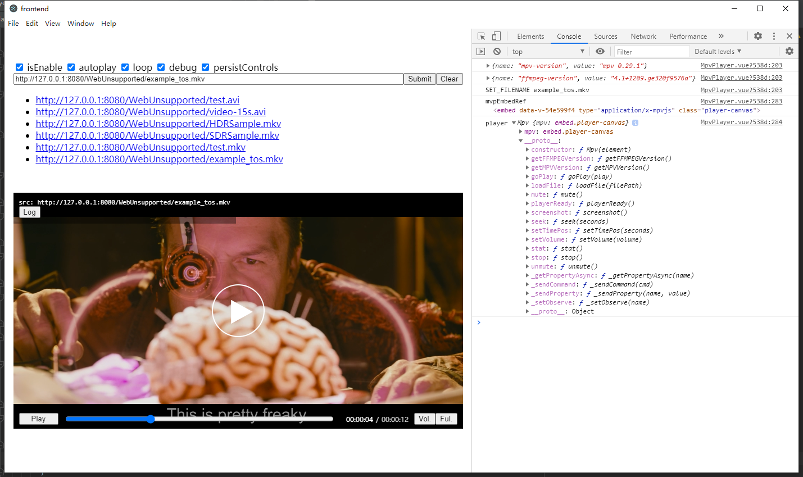

# electron-webchimera-vue Demo



## webchimera.js

https://github.com/RSATom/WebChimera.js

In package.json add "dependencies":

```
"webchimera.js": "*"
```

In main.js add:

```
process.env['VLC_PLUGIN_PATH'] = require('path').join(__dirname, '../node_modules/webchimera.js/plugins');
```

Install dependencies:

```
yarn
yarn install --ignore-scripts
```
